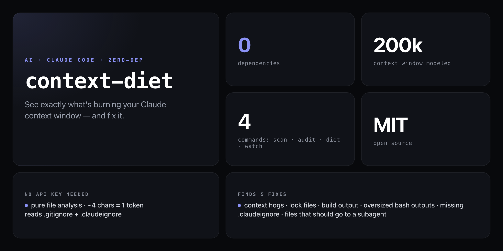

<div align="center">

**Stop burning context on things that don't matter. Find out what's eating your Claude session — and fix it.**


</div>

---

Your Claude Code context window holds 200,000 tokens. Most of that budget gets silently swallowed by `node_modules/`, lock files, build output, and minified assets — files that are never useful in context. `context-diet` makes the waste visible: scan your project, see the biggest offenders, and generate a `.claudeignore` that keeps future sessions lean.

```
context-diet · scanning ./my-project
━━━━━━━━━━━━━━━━━━━━━━━━━━━━━━━━━━━━━━━━━━

  Claude's context window:  200,000 tokens
  Your project (all files):  847,234 tokens  ← 4.2x too big

  What fits in one session:  23% of your project

TOP CONTEXT HOGS:
  📁 node_modules/          712,000 tokens  (84%)  → EXCLUDE
  📄 package-lock.json       45,000 tokens   (5%)  → EXCLUDE
  📄 src/server.js            8,200 tokens   (1%)  → Use with subagent
  📄 docs/api.md              4,100 tokens  (0.5%) → Load on demand

RECOMMENDED .claudeignore:
  node_modules/
  package-lock.json
  dist/
  *.min.js
  *.map

  Run: context-diet diet --write  to generate .claudeignore
━━━━━━━━━━━━━━━━━━━━━━━━━━━━━━━━━━━━━━━━━━
```

## Install

No install required — runs straight from GitHub with zero dependencies:

```bash
npx github:NickCirv/context-diet scan
```

Or install globally:

```bash
npm install -g github:NickCirv/context-diet
```

## Usage

```bash
# Scan current project for context hogs
npx github:NickCirv/context-diet scan

# Scan a specific directory
npx github:NickCirv/context-diet scan --path ./my-project

# Audit past Claude Code sessions
npx github:NickCirv/context-diet audit

# Show recommendations + generate .claudeignore
npx github:NickCirv/context-diet diet

# Generate .claudeignore file immediately
npx github:NickCirv/context-diet diet --write

# Live context budget monitor (updates as files change)
npx github:NickCirv/context-diet watch
npx github:NickCirv/context-diet watch --path ./src
```

| Command | Flag | Description |
|---------|------|-------------|
| `scan` | `--path <dir>` | Scan project, estimate token costs, identify top hogs, suggest smart loading strategy |
| `audit` | — | Read `~/.claude/projects/` session files — shows frequently loaded files, bash output sizes, recent session sizes |
| `diet` | `--write` | Recommendations for what to exclude; `--write` generates `.claudeignore` |
| `watch` | `--path <dir>` | Live updating context budget bar that refreshes as files change |

## What it finds

| Offender | Why it hurts |
|----------|-------------|
| `node_modules/` | Typically 500k–2M tokens — never useful in context |
| Lock files (`package-lock.json`, `yarn.lock`, etc.) | 10k–50k tokens of machine-generated noise |
| Build output (`dist/`, `build/`, `.next/`) | Compiled artefacts — load source instead |
| Minified files (`*.min.js`, `*.min.css`) | Unreadable and huge — source is what you want |
| Source maps (`*.map`) | Never useful in context |
| Large source files (>8k tokens) | Better handled by a subagent that returns a summary |
| Oversized bash outputs | Spotted in session history via `audit` — suggests `head`/`tail` or context-mode |

## .claudeignore

`context-diet diet --write` generates a `.claudeignore` for your project. It works exactly like `.gitignore` — Claude Code reads it to skip files that would waste your context budget:

```
node_modules/
dist/
build/
.next/
package-lock.json
yarn.lock
pnpm-lock.yaml
*.min.js
*.min.css
*.map
coverage/
```

Existing `.claudeignore` files are respected — new patterns are merged, not overwritten.

## How it works

Pure file analysis — no API key, no network calls. Scans your project tree, estimates tokens at `~4 chars = 1 token`, and compares totals against Claude's 200k context window. Reads `.gitignore` and `.claudeignore` to compute both raw and clean totals. The `audit` command reads `~/.claude/projects/*.jsonl` session files to surface patterns from your actual usage history.

## What it is NOT

- **Not a Claude Code plugin or extension.** It's a standalone CLI that runs independently — no Claude session required.
- **Not a guarantee.** Token estimates use the `~4 chars = 1 token` heuristic — accurate enough to catch major offenders, not a billing-exact count.
- **Not a replacement for `.gitignore`.** `.claudeignore` is a separate concern — files excluded from git may still be present locally and burn context.

---

<div align="center">
<sub>Zero dependencies · Node 18+ · MIT · by <a href="https://github.com/NickCirv">NickCirv</a></sub>
</div>
